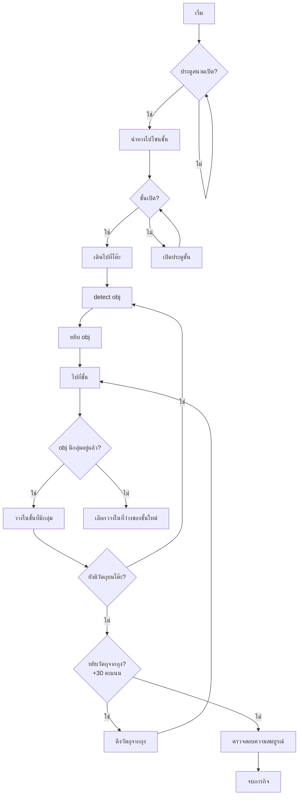

```mermaid
flowchart TD
    A[เริ่ม] --> B{ประตูสนามเปิด?}
    B -->|ใช่| C[นำทางไปโซนชั้น]
    B -->|ไม่| B
    
    C --> D{ชั้นเปิด?}
    D -->|ใช่| E[เดินไปที่โต๊ะ]
    D -->|ไม่| F[เปิดประตูชั้น]
    F --> D
    
    E --> G[detect obj]
    G --> PP[หยิบ obj]
    PP --> H[ไปที่ชั้น]
    H --> I{obj มีกลุ่มอยู่แล้ว?}
    I -->|ใช่| U[วางในชั้นที่มีกลุ่ม]
    I -->|ไม่| KK[เลือกวางในที่ว่างของชั้นใหม่]
    
    
    U --> V{ยังมีวัตถุบนโต๊ะ?}
    V -->|ใช่| G
    V -->|ไม่| W{หยิบวัตถุจากถุง? \n +30 คะแนน}
    
    W -->|ใช่| X[ดึงวัตถุจากถุง]
    X --> H
    W -->|ไม่| Y[ตรวจสอบความสมบูรณ์]
    
    Y --> Z[จบภารกิจ]

```
