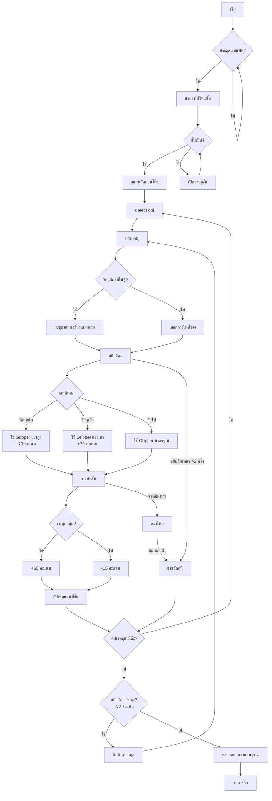

```mermaid
flowchart TD
    A[เริ่ม] --> B{ประตูสนามเปิด?}
    B -->|ใช่| C[นำทางไปโซนชั้น]
    B -->|ไม่| B
    
    C --> D{ชั้นเปิด?}
    D -->|ใช่| E[สแกนวัตถุบนโต๊ะ]
    D -->|ไม่| F[เปิดประตูชั้น]
    F --> D
    
    E --> G[detect obj]
    G --> H[หยิบ obj]
    
    H --> I{วัตถุมีกลุ่มในตู้?}
    I -->|ใช่| J[ระบุตำแหน่งชั้นที่ตรงกลุ่ม]
    I -->|ไม่| K[เลือกวางในที่ว่่าง]
    
    J --> L[หยิบวัตถุ]
    K --> L
    
    L --> M{วัตถุพิเศษ?}
    M -->|วัตถุหนัก| N[ใช้ Gripper แรงสูง \n +70 คะแนน]
    M -->|วัตถุเล็ก| O[ใช้ Gripper แรงเบา \n +70 คะแนน]
    M -->|ทั่วไป| P[ใช้ Gripper มาตรฐาน]
    
    N --> Q[วางบนชั้น]
    O --> Q
    P --> Q
    
    Q --> R{วางถูกกลุ่ม?}
    R -->|ใช่| S[+50 คะแนน]
    R -->|ไม่| T[-15 คะแนน]
    
    S --> U[อัปเดตแผนที่ชั้น]
    T --> U
    
    U --> V{ยังมีวัตถุบนโต๊ะ?}
    V -->|ใช่| G
    V -->|ไม่| W{หยิบวัตถุจากถุง? \n +30 คะแนน}
    
    W -->|ใช่| X[ดึงวัตถุจากถุง]
    X --> H
    W -->|ไม่| Y[ตรวจสอบความสมบูรณ์]
    
    Y --> Z[จบภารกิจ]
    
    %% Error handling
    L -->|หยิบล้มเหลว >2 ครั้ง| L1[ข้ามวัตถุนี้]
    L1 --> V
    Q -->|วางล้มเหลว| Q1[ลองใหม่]
    Q1 -->|ล้มเหลวซ้ำ| L1
```
