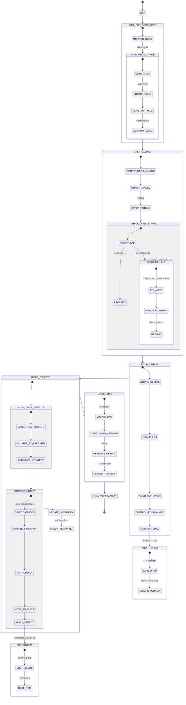

```mermaid
stateDiagram-v2
    [*] --> INIT
    INIT --> WAIT_FOR_DOOR_OPEN
    
    state WAIT_FOR_DOOR_OPEN {
        [*] --> MONITOR_DOOR
        MONITOR_DOOR --> NAVIGATE_TO_TABLE : เมื่อประตูเปิด
    }
    
    state NAVIGATE_TO_TABLE {
        [*] --> SCAN_AREA
        SCAN_AREA --> LOCATE_TABLE : ตรวจจับโต๊ะ
        LOCATE_TABLE --> MOVE_TO_TABLE
        MOVE_TO_TABLE --> CONFIRM_TABLE : ยืนยันตำแหน่ง
    }
    
    NAVIGATE_TO_TABLE --> OPEN_CABINET
    
    state OPEN_CABINET {
        [*] --> DETECT_DOOR_HANDLE
        DETECT_DOOR_HANDLE --> GRASP_HANDLE
        GRASP_HANDLE --> APPLY_TORQUE : ดึงประตู
        APPLY_TORQUE --> CHECK_OPEN_STATUS
        
        state CHECK_OPEN_STATUS {
            [*] --> VERIFY_GAP
            VERIFY_GAP --> REQUEST_HELP : หากเปิดไม่สำเร็จ
            VERIFY_GAP --> PROCEED : หากเปิดสำเร็จ
        }
    }
    
    OPEN_CABINET --> POUR_CEREAL
    
    state POUR_CEREAL {
        [*] --> LOCATE_CEREAL
        LOCATE_CEREAL --> GRASP_BOX
        GRASP_BOX --> ALIGN_CONTAINER
        ALIGN_CONTAINER --> CONTROL_POUR_ANGLE
        CONTROL_POUR_ANGLE --> MONITOR_SPILL
    }
    
    POUR_CEREAL --> STORE_OBJECTS
    
    state STORE_OBJECTS {
        [*] --> SCAN_TABLE_OBJECTS
        
        state SCAN_TABLE_OBJECTS {
            [*] --> DETECT_ALL_OBJECTS
            DETECT_ALL_OBJECTS --> CLUSTER_BY_FEATURES
            CLUSTER_BY_FEATURES --> GENERATE_STRATEGY
        }
        
        SCAN_TABLE_OBJECTS --> PROCESS_OBJECT
        
        state PROCESS_OBJECT {
            [*] --> SELECT_OBJECT : เลือกตามน้ำหนัก/ขนาด
            SELECT_OBJECT --> ANALYZE_SIMILARITY
            ANALYZE_SIMILARITY --> PICK_OBJECT
            PICK_OBJECT --> MOVE_TO_SHELF
            MOVE_TO_SHELF --> PLACE_OBJECT
        }
        
        PROCESS_OBJECT --> UPDATE_INVENTORY
        UPDATE_INVENTORY --> CHECK_REMAINING : ยังมีวัตถุเหลือ?
    }
    
    STORE_OBJECTS --> HANDLE_BAG
    
    state HANDLE_BAG {
        [*] --> LOCATE_BAG : หาถุงช้อปปิ้ง
        LOCATE_BAG --> DETECT_BAG_OPENING
        DETECT_BAG_OPENING --> RETRIEVE_OBJECT : ดึงวัตถุ
        RETRIEVE_OBJECT --> CLASSIFY_OBJECT : จำแนกประเภท
    }
    
    HANDLE_BAG --> FINAL_VERIFICATION
    FINAL_VERIFICATION --> [*]
    
    %% Error handling transitions
    CHECK_OPEN_STATUS --> REQUEST_HELP : ประตูไม่เปิด\n(3 ครั้งล้มเหลว)
    MONITOR_SPILL --> ABORT_POUR : ซีเรียลหก >10%
    PLACE_OBJECT --> SKIP_OBJECT : การวางล้มเหลว\n(2 ครั้ง)
    
    state REQUEST_HELP {
        [*] --> TTS_ALERT : "เปิดตู้ล้มเหลว กรุณาช่วยเหลือ"
        TTS_ALERT --> WAIT_FOR_HUMAN
        WAIT_FOR_HUMAN --> RESUME : เมื่อประตูเปิดแล้ว
    }
    
    state ABORT_POUR {
        [*] --> SAFE_DROP : วางกล่องซีเรียล
        SAFE_DROP --> RECORD_PENALTY : บันทึกการหักคะแนน
    }
    
    state SKIP_OBJECT {
        [*] --> LOG_FAILURE : บันทึกวัตถุที่ข้าม
        LOG_FAILURE --> NEXT_ITEM : ไปวัตถุถัดไป
    }
```
